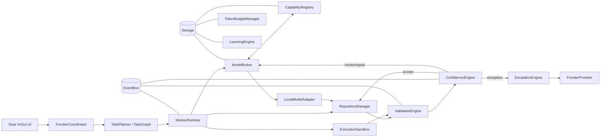
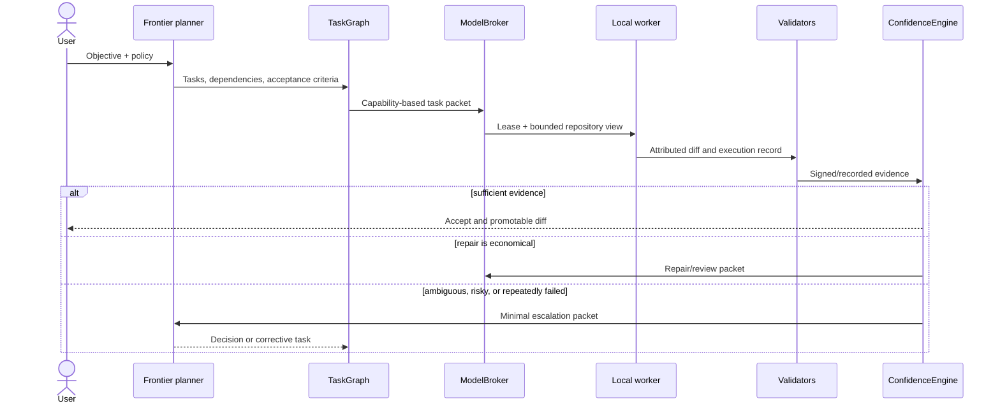

# Frontier Relay Reference Architecture

## 1. System objective

Frontier Relay is a standalone, local-first desktop orchestration system for software engineering. It maximizes **quality per frontier token** by giving bounded implementation work to locally authorized open-weight models, collecting objective evidence, and involving a frontier provider only for planning, ambiguity, high-risk review, or failed work.

The first vertical slice intentionally proves only this control loop:

> task packet → capability routing → isolated local worker → validation → confidence → accept/escalate

It is not yet an autonomous coding agent. The checked-in local adapter is deterministic, and its output is a harmless artifact in a temporary workspace.

## 2. Architectural principles and decisions

1. **Local first; frontier by exception.** Policy, risk, and evidence—not model branding—control escalation.
2. **Capability requests, never provider selection in plans.** A task asks for `c++`, `repository-understanding`, or `tool-use`; the broker selects an eligible adapter.
3. **Evidence precedes confidence.** Self-reported model confidence is not a signal. Missing critical validators is a failure, not a neutral result.
4. **Bounded context.** Workers receive task packets and a filtered repository view. Frontier escalation receives the objective, minimal diff, failures, attempts, confidence, and one unresolved question.
5. **Isolation by default.** Work occurs in a disposable Git worktree or sandbox; promotion is a separate audited operation.
6. **Interfaces before integrations.** Providers, inference runtimes, validators, storage, and execution backends are replaceable.
7. **Deterministic V1 learning.** Routing uses capability filters and observed statistics. No training pipeline or vector database is justified for the MVP.
8. **Event-driven core, not event-sourced everything.** Events decouple runtime observers; durable state remains transactional. Commands have explicit owners and idempotency keys.
9. **C++26 target with a portable C++23 baseline today.** Current broadly available build tooling does not consistently expose a `cxx_std_26` CMake feature. The MVP avoids non-portable extensions and can move to the standardized flag without redesign.

## 3. Component architecture



- **FrontierCoordinator / TaskPlanner** creates a dependency graph and records assumptions. It does not implement routine code.
- **TaskGraph scheduler** releases dependency-ready tasks concurrently while serializing tasks whose file scopes overlap.
- **ModelBroker / CapabilityRegistry** discovers eligible adapters, applies resource/policy constraints, and ranks candidates empirically.
- **WorkerRuntime** enforces packet bounds, attempts, cancellation, leases, and deadlines.
- **RepositoryManager / ExecutionSandbox** create worktrees, attribute diffs, restrict commands, and enable rollback.
- **ValidationEngine** runs modular validators and preserves raw evidence.
- **ConfidenceEngine** applies a versioned policy to evidence; **EscalationEngine** creates a redacted minimal packet.
- **LearningEngine** updates task/model aggregates only after final outcome is known.
- **TokenBudgetManager** meters actual provider usage and counterfactual estimates separately.
- **EventBus** emits typed lifecycle facts for UI, audit, and metrics. A production implementation needs bounded queues and backpressure.

## 4. Data flow



Repository content is referenced by immutable commit and content hashes. Large logs are stored once; packets carry references plus tightly limited excerpts.

## 5. Task lifecycle

`CREATED → READY → ASSIGNED → RUNNING → VALIDATING → {ACCEPTED, LOCAL_REVIEW, REPAIR, ESCALATED, REJECTED}`

Assignments use leases so a crashed worker cannot retain a task forever. Each attempt has an immutable record. Retry is allowed only for categorized transient/repairable failures and is capped by the packet. Cancellation and supersession are first-class. A task is accepted only if dependencies are accepted, required validators ran, the diff remains within its declared scope, and the confidence policy permits it.

A packet contains task ID, objective, base commit, relevant paths, constraints, expected output, allowed tools/commands, acceptance criteria, required validators, risk class, maximum attempts, time/resource limits, and secrets policy. It does **not** contain unrestricted chat history.

## 6. Model routing architecture

Adapters expose identity, runtime family, model fingerprint/version, state (`AVAILABLE`, `BUSY`, `UNAVAILABLE`, `FAILED`, `LOADING`), context limit, capabilities, language scores, tool protocol, quantizations, resource requirements, and health timestamp. Runtime discovery is adapter-specific (local socket, supervised process, or configured endpoint), with heartbeat expiry and circuit breaking.

Routing has two stages:

1. **Hard filter:** availability, required capabilities, context fit, hardware, sandbox/tool compatibility, privacy policy, and deadline.
2. **Rank:** smoothed task-family success rate, validation pass rate, latency, retries, context cost, queue time, and exploration allowance. Sparse histories use a global prior so one lucky attempt cannot dominate.

The MVP broker implements the shape of this algorithm: hard capability filtering and reliability/latency ranking. Later, deterministic contextual bandit-style exploration can avoid permanent model starvation without ML infrastructure. Model families and providers remain data, never enum cases in orchestration code.

Consensus is enabled by risk/cost policy: security-sensitive, architecture-wide, destructive, or low-margin decisions may request independent solve/review/test roles. Reviewers must not receive the author's chain-of-thought; they receive requirements and the diff. Consensus does not replace objective validation.

## 7. Confidence architecture

Confidence is a versioned policy evaluation, not a claim that “the code is 94% correct.” Validators emit `{type, status, weight, criticality, command, exit code, artifact hash, timestamp, details}`. Possible signals include build, unit/integration/regression tests, static analysis, types, security rules, API/ABI compatibility, requirement coverage, diff scope, and independent review.

Policies specify required signals by task/risk class, calibrated weights, staleness, and gates. A failed critical security/build signal always blocks acceptance regardless of the weighted total. Unknown/missing differs from passed. Historical reliability is capped so it cannot rescue failed evidence. Scores and thresholds are calibrated against eventual accepted/reverted outcomes.

Suggested actions remain configurable: auto-accept, local review, independent repair, or frontier escalation. The MVP normalizes validator weight to 90 points and caps model history at 10 points; this is demonstrative rather than production calibration.

## 8. Frontier escalation architecture

`FrontierProvider` represents only explicitly authorized provider sessions. It supports provider capabilities, token metering, cancellation, and structured request/response; authentication is implemented behind a separate secure boundary. OAuth authorization codes, OS credential storage, and provider SDKs may be used when officially supported. The system must never scrape, export, impersonate, or bypass protected credentials.

An escalation packet contains objective, task/attempt IDs, relevant diff hunks, failing evidence and short error excerpts, prior actions, risk class, score/policy version, token budget, and one concrete unresolved question. Secret scanning and repository policy redact the packet before user-visible approval where required. Full repository or transcripts are opt-in, never the default.

## 9. Token optimization strategy

- Plan once into stable task contracts; transmit deltas and content-addressed references afterward.
- Retrieve only declared paths plus dependency symbols; progressively widen context on demonstrated need.
- Cache summaries with commit hashes and invalidate them on relevant changes.
- Prefer cheap local validation/independent review when its expected cost is below frontier escalation and risk permits.
- Stop retrying when marginal success probability falls below policy.
- Meter frontier input/output and local input/output separately. “Frontier tokens avoided” is a labeled estimate based on a versioned counterfactual, not a guaranteed saving.
- Policies `ECONOMY`, `BALANCED`, `QUALITY`, and `CUSTOM` set risk gates, retry/consensus budgets, and escalation thresholds—not just one score cutoff.

## 10. Security boundaries

The repository, model runtime, command sandbox, provider authentication, plugin host, and promotion operation are separate trust boundaries. Local models are untrusted input producers. Required controls include Git worktrees pinned to a base commit; path canonicalization and symlink defenses; allowlisted commands; process, CPU, memory, disk, output, and network limits; environment and secret minimization; diff/file-count auditing; immutable attribution; dependency-install policy; prompt-injection-resistant repository handling; and explicit user approval for destructive or external effects.

Containers alone are not a complete security boundary. Platform backends should use OS primitives and run under least privilege. Promotion revalidates against the current target commit to prevent time-of-check/time-of-use errors. Every action records task, attempt, worker, model fingerprint, timestamp, command, base commit, changed hashes, and validation results.

## 11. C++26 module structure

The repository begins with conventional headers/sources because compiler support for standardized C++ modules remains uneven. Logical modules are:

```text
app/                         CLI now; Dear ImGui shell later
core/include/frontier_relay/ domain contracts, interfaces, events, MVP services
core/src/                    broker, confidence, vertical orchestration
tests/                       dependency-free executable tests
docs/                        architecture and decisions
```

Future bounded directories map to `planner`, `tasks`, `router`, `models`, `workers`, `validation`, `confidence`, `escalation`, `budget`, `repository`, `execution`, `storage`, `events`, `ui`, `providers`, and `plugins`. Avoid creating empty directories or libraries until the vertical slice needs them. Ownership types, `std::span`, value objects, RAII, `std::stop_token`, and structured concurrency abstractions are preferred. Dear ImGui remains a view over event/read models and must not own orchestration state.

## 12. Database design and the PGlite decision

**Decision: do not embed PGlite in the native C++ MVP.** PGlite packages PostgreSQL for a WebAssembly/JavaScript environment. A C++ desktop integration would require embedding and operating a JS/Wasm host, bridging asynchronous APIs, and accepting a deployment surface unrelated to the core proof. That coupling is not justified.

V1 should use SQLite through a narrow `Storage` interface: it is embedded, transactional, mature, and readily deployable in native C++. SQL migrations should stay conservative and PostgreSQL-portable where practical, while acknowledging that SQLite and PostgreSQL differ in types, concurrency, DDL, and JSON semantics. Production or team mode can add a native PostgreSQL adapter. PGlite can later be reconsidered for a web companion process, not treated as the native database. No vector database is needed; symbol indexes and full-text search precede embeddings, and PostgreSQL/pgvector can be evaluated only if evidence supports retrieval value.

Initial relational entities:

```text
repositories(id, canonical_path, remote_fingerprint, created_at)
tasks(id, repository_id, parent_id, objective, state, risk, base_commit, policy_version)
task_dependencies(task_id, depends_on_id)
attempts(id, task_id, model_id, worker_id, started_at, ended_at, outcome, failure_category)
models(id, adapter, family, fingerprint, state, capabilities_json, last_seen_at)
changes(id, attempt_id, base_commit, diff_hash, manifest_json)
validation_runs(id, attempt_id, validator, status, weight, critical, artifact_hash, detail_json)
confidence_results(id, attempt_id, score, action, policy_version, evidence_hash)
escalations(id, attempt_id, provider_id, question, request_tokens, response_tokens, outcome)
usage_ledger(id, task_id, provider_kind, input_tokens, output_tokens, estimated_cost, measured_at)
events(sequence, aggregate_id, type, schema_version, payload_json, occurred_at)
```

Foreign keys, unique attempt numbers, idempotency keys, and append-only audit rows are required. Capability/task performance aggregates are derived from final outcomes, not trusted worker reports.

## 13. Major interfaces

The skeleton defines `FrontierCoordinator`, `CapabilityRegistry`, `ModelBroker`, `LocalModelAdapter`, `Validator`, and `ConfidenceEngine`. Next interfaces are:

```cpp
struct TaskPlanner { virtual TaskGraph plan(const UserObjective&, const RepositorySummary&) = 0; };
struct WorkerRuntime { virtual AttemptHandle start(const TaskPacket&, ModelLease) = 0; };
struct RepositoryManager { virtual Worktree stage(const RepositoryId&, CommitId) = 0; };
struct ExecutionSandbox { virtual CommandResult run(const CommandSpec&, std::stop_token) = 0; };
struct ValidationEngine { virtual EvidenceBundle run(const ValidationPlan&, const ChangeSet&) = 0; };
struct EscalationEngine { virtual EscalationResult request(const EscalationPacket&) = 0; };
struct FrontierProvider { virtual ReviewResult review(const RedactedPacket&, TokenBudget) = 0; };
struct Storage { virtual UnitOfWork transaction() = 0; };
```

Interfaces pass domain values rather than provider JSON. Provider and plugin calls are versioned, timed, cancellable, metered, and isolated.

## 14. MVP scope

Implemented now: one task packet, an in-memory registry, capability-based broker, deterministic local adapter, temporary workspace artifact, objective validator, weighted confidence, accept/escalate action, lifecycle events, CLI demonstration, and executable tests. This proves wiring and policy boundaries without claiming genuine code generation.

Mocked or deferred: frontier planning/review, real inference discovery, Git worktrees, command sandbox, compiler/test validators, persistence, retries, graph scheduling, usage metering, learning, consensus, provider authentication, plugins, and Dear ImGui. These must not be represented as secure or production-ready.

## 15. Implementation phases

1. **Harden the slice:** real Git worktree manager, process sandbox facade, command/build/test validators, structured error handling, SQLite audit store.
2. **Use a real local runtime:** one adapter over a documented local protocol, health discovery, leases, bounded patch format, patch application and file audit.
3. **Plan and escalate:** mock frontier planner contract, DAG scheduler, redacted escalation packet, budget ledger, authorized provider test double.
4. **Desktop workflow:** Dear ImGui dashboard for graph, models, evidence, confidence, tokens, logs, and settings; keep all operations in application services.
5. **Empirical routing:** task taxonomy, smoothed aggregates, controlled exploration, retry economics, and risk-triggered consensus.
6. **Production hardening:** platform isolation backends, signing/audit integrity, crash recovery, migrations, plugin protocol, authentication integrations, and adversarial tests.

## 16. Major technical risks and incorrect assumptions

- **“Local” is not synonymous with private, safe, cheap, or capable.** Runtime telemetry, model licenses, power/latency, malicious repository content, and tool permissions matter.
- **A scalar confidence score can mislead.** It requires mandatory gates, calibrated outcomes, provenance, and a human-readable evidence breakdown.
- **Tests are not proof of requirement satisfaction.** Generated tests can encode the same misunderstanding as generated code; independent checks and risk-specific policies are needed.
- **Parallel tasks conflict.** DAG independence does not imply disjoint edits. File/symbol claims, merge ordering, and revalidation are necessary.
- **Token savings are counterfactual.** Local retries, prompt construction, validation compute, and frontier repair can erase savings; report measured and estimated values separately.
- **C++26/toolchain availability is uneven.** Pin tested compilers and dependencies; do not depend on draft-only features in the initial portable core.
- **Dear ImGui is a rendering layer, not an application architecture.** Accessibility, long logs, graph rendering, docking, and asynchronous state need deliberate support.
- **PostgreSQL compatibility is not obtained merely by using PostgreSQL-like SQL.** Storage contracts and integration tests against both SQLite and PostgreSQL are needed before claiming portability.
- **Model capability declarations are untrusted and drift with quantization/runtime.** Benchmark observed model fingerprints and decay stale statistics.
- **Automatic acceptance has real liability.** Default acceptance should mean “eligible for controlled promotion,” with configurable human gates for sensitive repositories.

